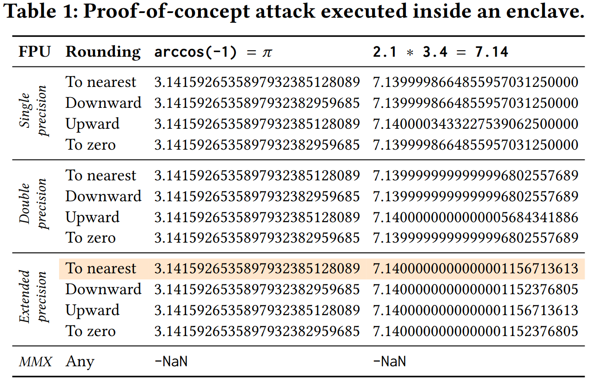

# Basic proof of concept attack to reproduce Table 1

[](https://travis-ci.org/github/fritzalder/faulty-point-unit)

This proof of concept attack showcases the basic issue described in the paper and can be used to reproduce Table 1. The code in this poc consist of a simple enclave with two ECALLs that performs two calculations and of an untrusted part that executes both ECALLs and prints their result. In doing so, the untrusted application uses the fpu_lib library in the project_root/lib folder. This library allows to change between different FPU settings based on environment variables. The benefit of this approach is that there is no need to recompile the untrusted application for every setting of the FPU registers (rounding mode, precision, MMX attack). Instead, the untrusted application can simply be executed multiple times with different environment variables to quickly calculate all desired results.



## Running Table 1 with eval scripts
We provide three easy-to-use scripts. The sample outputs of two setups are appended to the end of this Readme.
| Script name| Description|
| :-- | :-- |
| eval.sh | Runs the poc code in all combinations and prints an output similar to Table 1 of the paper. Performs 15 runs: 3 x 5 (3 precision modes, 4 rounding modes and 1 MMX mode) |
| eval_simulator.sh | Runs the same code as above just in the simulator |
| run-and-save-eval.sh | Runs the eval code but instead of printing to the console, store in evaluations folder for archiving of evaluation data. This is how the existing data in the evaluations/ subfolder was created and how the Table 1 paper data was gathered. Uses hardware mode. |

## Running Table 1 manually
Compile the project either in hardware mode: `make all SGX_MODE=HW` or in simulation mode: `make all SGX_MODE=SIM`. Then, run `./inc` to perform a simple run with the OS's default FPU modes.

You can control the FPU library that sets the FPU to desired values by modifying the following environment variables:
| Variable name | Allowed values | Description|
| :-- | :-- | :--- |
| FPU_ROUND | UP DOWN TO_NEAREST or TO_ZERO | Sets the x87 and SSE rounding modes.|
| FPU_PRECISION | SINGLE DOUBLE or EXTENDED| Sets the x87 precision mode (does not exist for SSE)|
| FPU_MMX | Only active when set to TRUE| Marks the FPU tag word as full which prevents the program from using the FPU.|
| FPU_VERBOSE | Only active when set to TRUE| Enters a verbose mode that prints the MXCSR and FCW before and after execution and at every change by the library.|
| FPU_LIB_ENABLED | Only active when set to TRUE | If set, uses a constructor and destructor to run before and after the C program to set the FPU mode before the program even executes. This is convenient for programs that are unaware of the library and just have it included at compile time. You do NOT need this variable for e.g. this project as it calls the faulty_points_init and faulty_points_reset functions manually. |

Examples for the manual usage can also be deduced from the eval scripts, but here are three simple use cases:

Execution of the program with default parameters (should not differ from a call of the program without any environment variables set): `FPU_PRECISION=EXTENDED FPU_ROUND=TO_NEAREST ./inc`<br>

One of the modes with the largest floating point error is using single precision and rounding down: `FPU_PRECISION=SINGLE FPU_ROUND=DOWN ./inc`

Performing the MMX attack on double precision and default rounding mode (to nearest). Note, that the rounding or precision mode settings do not have any impact on the result of the MMX attack as it merely prevents utilization of the FPU due to all MMX registers being marked as in-use: `FPU_PRECISION=DOUBLE FPU_ROUND=TO_NEAREST FPU_MMX=TRUE ./inc`

## Sample outputs of the eval script
Sample output where we first switch to the vulnerable SDK with the SDK helper by sourcing it in the root directory of this project and then run the eval in the simulator. This gives the most easily reproducible result as it requires no extra hardware.
```bash
~/tmp/faulty-point-unit/01_table1_basic-poc$ source ../sdk_helper.sh vulnerable
Switching to vulnerable SDK 2.7.1...
Set environment variables as follows:
PATH: /home/fritz/.local/bin:/usr/local/sbin:/usr/local/bin:/usr/sbin:/usr/bin:/sbin:/bin:/usr/games:/usr/local/games:/snap/bin:.::/home/fritz/tmp/faulty-point-unit/dependencies/sdk_2.7.1._installation/sgxsdk/bin:/home/fritz/tmp/faulty-point-unit/dependencies/sdk_2.7.1._installation/sgxsdk/bin/x64
PKG_CONFIG_PATH: :/home/fritz/tmp/faulty-point-unit/dependencies/sdk_2.7.1._installation/sgxsdk/pkgconfig
LD_LIBRARY_PATH: /home/fritz/tmp/faulty-point-unit/dependencies/sdk_2.7.1._installation/sgxsdk/sdk_libs
done.
 ~/t/faulty-point-unit/01_table1_basic-poc$
 ~/t/faulty-point-unit/01_table1_basic-poc$
 ~/t/faulty-point-unit/01_table1_basic-poc$ ./eval_simulator.sh
[===] Enclave [===]
[RM] inc.o inc.unsigned.so inc.so libinc_proxy.a
[RM] inc_t.o inc_u.o inc_t.h inc_t.c inc_u.h inc_u.c
[RM] main.o inc
[===] Enclave [===]
[GEN] sgx_edger8r inc.edl
[CC]  inc_t.c (trusted edge)
[CC]  inc.c (core)
[LD]   inc.o inc_t.o -lsgx_trts_sim inc.unsigned.so
[SGN] inc.unsigned.so
[CC]  inc_u.c (untrusted edge)
[AR]   libinc_proxy.a
[CC]  main.c
[LD] main.o -o inc
-fPIC -fno-stack-protector -fno-builtin -fno-jump-tables -fno-common -Wno-attributes -g -D_GNU_SOURCE 
###########################################################################################
# Compiled in SIMULATION mode. You can compile either with SGX_MODE=HW or SGX_MODE=SIM #
###########################################################################################

---------------------------------------------------------------------------
SINGLE PRECISION
Rounding  | arccos(-1) = pi                   | 2.1 * 3.4 = 7.14
---------------------------------------------------------------------------
Nearest:    3.14159265358979323851280896 	7.13999986648559570312500000 
Down:       3.14159265358979323829596852 	7.13999986648559570312500000 
Up:         3.14159265358979323851280896 	7.14000034332275390625000000 
To Zero:    3.14159265358979323829596852 	7.13999986648559570312500000 
MMX attack: -nan 	-nan 
---------------------------------------------------------------------------
DOUBLE PRECISION
Rounding  | arccos(-1) = pi                   | 2.1 * 3.4 = 7.14
---------------------------------------------------------------------------
Nearest:    3.14159265358979323851280896 	7.13999999999999968025576891 
Down:       3.14159265358979323829596852 	7.13999999999999968025576891 
Up:         3.14159265358979323851280896 	7.14000000000000056843418861 
To Zero:    3.14159265358979323829596852 	7.13999999999999968025576891 
MMX attack: -nan 	-nan 
---------------------------------------------------------------------------
EXTENDED PRECISION
Rounding  | arccos(-1) = pi                   | 2.1 * 3.4 = 7.14
---------------------------------------------------------------------------
Baseline/
Nearest:    3.14159265358979323851280896 	7.14000000000000011567136138 
Down:       3.14159265358979323829596852 	7.14000000000000011523768051 
Up:         3.14159265358979323851280896 	7.14000000000000011567136138 
To Zero:    3.14159265358979323829596852 	7.14000000000000011523768051 
MMX attack: -nan 	-nan 


```

Running the evaluation script in hardware mode with the patched SDK by first switching to the patched SDK and then executing the hardware mode eval script:
```bash
~/tmp/faulty-point-unit/01_table1_basic-poc$ source ../sdk_helper.sh patched
Switching to patched SDK 2.8...
Set environment variables as follows:
PATH: /home/fritz/.local/bin:/usr/local/sbin:/usr/local/bin:/usr/sbin:/usr/bin:/sbin:/bin:/usr/games:/usr/local/games:/snap/bin:.:/opt/intel/sgxsdk/bin:/opt/intel/sgxsdk/bin/x64
PKG_CONFIG_PATH: /opt/intel/sgxsdk/pkgconfig
LD_LIBRARY_PATH: /opt/intel/sgxsdk/sdk_libs
done.
~/tmp/faulty-point-unit/01_table1_basic-poc$
~/tmp/faulty-point-unit/01_table1_basic-poc$
~/tmp/faulty-point-unit/01_table1_basic-poc$ ./eval.sh 
[===] Enclave [===]
[RM] inc.o inc.unsigned.so inc.so libinc_proxy.a
[RM] inc_t.o inc_u.o inc_t.h inc_t.c inc_u.h inc_u.c
[RM] main.o inc
[===] Enclave [===]
[GEN] sgx_edger8r inc.edl
[CC]  inc_t.c (trusted edge)
[CC]  inc.c (core)
[LD]   inc.o inc_t.o -lsgx_trts inc.unsigned.so
[SGN] inc.unsigned.so
[CC]  inc_u.c (untrusted edge)
[AR]   libinc_proxy.a
[CC]  main.c
[LD] main.o -o inc
-fPIC -fno-stack-protector -fno-builtin -fno-jump-tables -fno-common -Wno-attributes -g -D_GNU_SOURCE 
###########################################################################################
# Compiled in HARDWARE mode. You can compile either with SGX_MODE=HW or SGX_MODE=SIM #
###########################################################################################

---------------------------------------------------------------------------
SINGLE PRECISION
Rounding  | arccos(-1) = pi                   | 2.1 * 3.4 = 7.14
---------------------------------------------------------------------------
Nearest:    3.14159265358979323851280896 	7.14000000000000011567136138 
Down:       3.14159265358979323851280896 	7.14000000000000011567136138 
Up:         3.14159265358979323851280896 	7.14000000000000011567136138 
To Zero:    3.14159265358979323851280896 	7.14000000000000011567136138 
MMX attack: 3.14159265358979323851280896 	7.14000000000000011567136138 
---------------------------------------------------------------------------
DOUBLE PRECISION
Rounding  | arccos(-1) = pi                   | 2.1 * 3.4 = 7.14
---------------------------------------------------------------------------
Nearest:    3.14159265358979323851280896 	7.14000000000000011567136138 
Down:       3.14159265358979323851280896 	7.14000000000000011567136138 
Up:         3.14159265358979323851280896 	7.14000000000000011567136138 
To Zero:    3.14159265358979323851280896 	7.14000000000000011567136138 
MMX attack: 3.14159265358979323851280896 	7.14000000000000011567136138 
---------------------------------------------------------------------------
EXTENDED PRECISION
Rounding  | arccos(-1) = pi                   | 2.1 * 3.4 = 7.14
---------------------------------------------------------------------------
Baseline/
Nearest:    3.14159265358979323851280896 	7.14000000000000011567136138 
Down:       3.14159265358979323851280896 	7.14000000000000011567136138 
Up:         3.14159265358979323851280896 	7.14000000000000011567136138 
To Zero:    3.14159265358979323851280896 	7.14000000000000011567136138 
MMX attack: 3.14159265358979323851280896 	7.14000000000000011567136138
```
