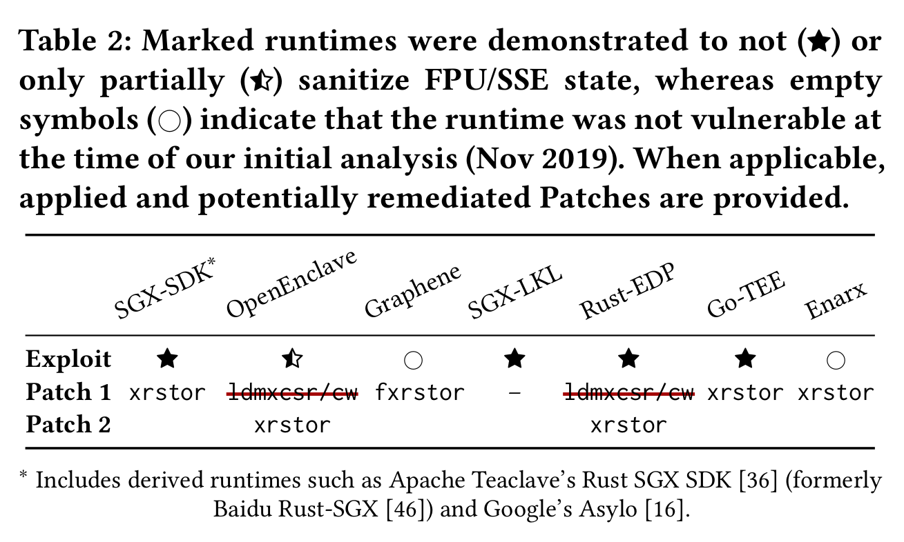

# Proof of concept attacks on different enclave shielding runtimes

Table 2 in the paper describes the vulnerability landscape of multiple enclave shielding runtimes, each described in their own subdirectory. We provide proof-of-concept poisoning attacks against all runtimes marked with a star. Namely, OpenEnclave, SGX-LKL, Rust-EDP, and Go-TEE (for Intel SGX-SDK, see the artifact for Table 1).

## A note on remaining MMX attack surface

During our systematic analysis, we discovered that ABI poisoning was originally insufficiently patched in some runtimes. Specifically, the paper and the above table show how the initial patch for OpenEnclave and Rust-EDP only initialed the SSE `MXCSR` and x87 control-word registers, leaving a subtle remaining attack surface through the x87 tag register.

Concretely, the remaining attack variant is based on certain ABI state expectations. The System V ABI states that:

> The CPU shall be in x87 mode upon entry to a function. Therefore, every function  that  uses the MMX registers  is  required  to  issue an emms or femms instruction after using MMX registers, before returning or calling another function.

The Intel SDM writes that:

> However, because the MMX registers are aliased to the x87 FPU register stack, care must be taken when making transitions between x87 FPU instructions and MMX instructions to prevent incoherent or unexpected results. [...] When an x87 FPU instruction is executed, the processor assumes that the current state of the x87 FPU register stack and control registers is valid and executes the instruction without any preparatory modifications to the x87 FPU state

An attack thus proceeds as follows:

 1. Attacker executes an MMX instruction before entering the enclave
 2. --> The CPU sets x87 TOS=0 and TAG=0xffff (all valid)
 3. Enclave executes x87 instructions that load data into the x87 stack
 4. --> The CPU detects an FPU stack overflow and breaks enclave integrity and/or confidentiality:
    * If exceptions are masked? Enclave silently continues with indefinite result (NaN) (integrity corruption)
    * If exceptions are unmasked? The attacker learns that an x87 instruction was executed (e.g., in secret-dependent execution path)

To properly address this remaining MMX attack surface, we explicitly recommend that all runtimes perform a full `xrstor` on enclave entry, which is the mitigation that got adapted by most runtimes as summarized in the table above.
