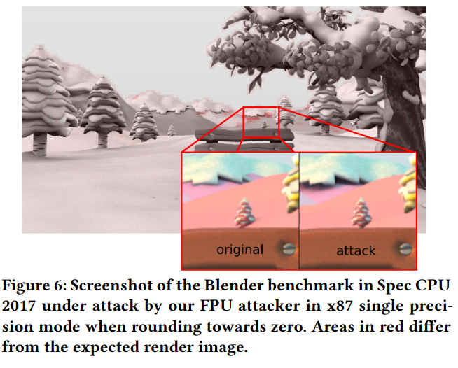

# Output of the blender_r benchmark in the SPEC CPU 2017 suite

The images in this directory are the result of running the SPEC CPU 2017 suite when following the instructions given in the description of the SPEC case study (more details are given in directory 05_section-6_spec-cpu-2017 ). The benefit of the blender benchmark is its generation of easily viewable images that can be used to showcase the differences between original, unattacked benchmarks, and attacked benchmarks.



## Reproducing these images

As described in the Readme of the project and in the subdirectory of the Spec CPU 2017 case study, we do **not** expect artifact reviewers to generate the raw data of the SPEC CPU 2017 suite themselves. Additionally, due to licensing and copyright restrictions with the proprietary SPEC 2017 suite, we can only provide the used configuration file and detailed instructions how to reproduce our results for people who already bought the SPEC CPU 2017 suite. Please note, that obtaining the raw data for the SPEC benchmarks summarized in Table 4 of the paper takes several CPU weeks. Obtaining the raw data of just the single blender_r benchmark however takes significantly less time, as not the full suite but just one benchmark has to be completed.

If one wishes to reproduce just the blender output, first follow the instructions given in the general SPEC CPU 2017 subfolder. As described in the paper, the images in this folder were generated under an FPU attacker that utilizes single precision mode and rounding towards zero. The desired output can be achieved by executing SPEC with just blender_r as workload: 
```bash
export FPU_ROUND=DOWN
export FPU_PRECISION=SINGLE
export FPU_VERBOSE=FALSE
runcpu --config=attack-fpus --size=ref --copies=1 --noreportable --iterations=1 --threads=4 blender_r
```

The benchmark blender_r produces the output file that is then compared by the SPEC CPU 2017 suite with the `imagevalidate` tool that is also compiled into the output folder. We can use this tool to create the diff image that is also included in this directory: `./imagevalidate_526_base.attack-library-m64 -diff blender-original-to-attack-diff.tga blender_original.tga blender_attack.tga`. Here, the blender_original.tga is included in the blender_r benchmark as one of the original reference resources.
